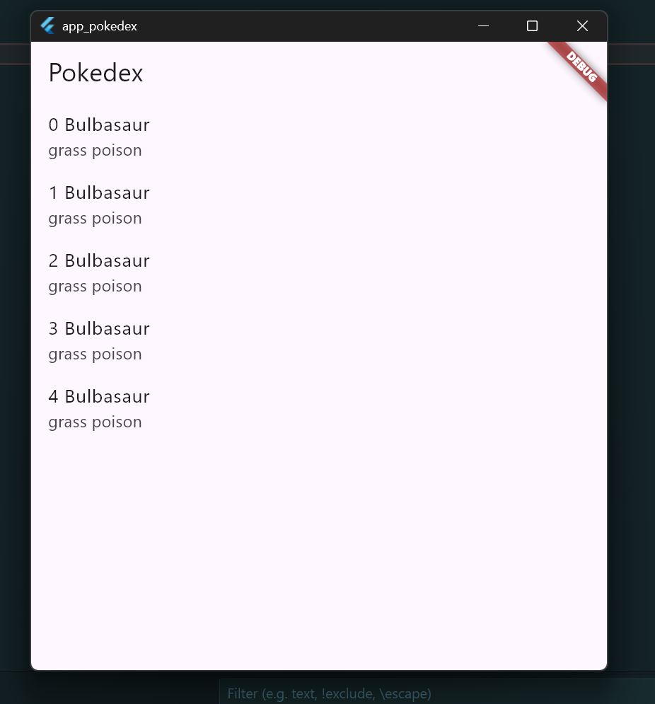
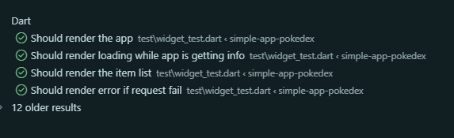

# Widget testing

This app shows a list of item  from an API or DB adapter. 
The purpose of this app is to mock the scenarios and test it using Widget Testing.


### Prerequisites 
- Flutter 3.41.5 
- Dart 3.11.3 

### Run
```bash
flutter pug get 
flutter run -d chrome
flutter test
```

### Preview


### Testing

